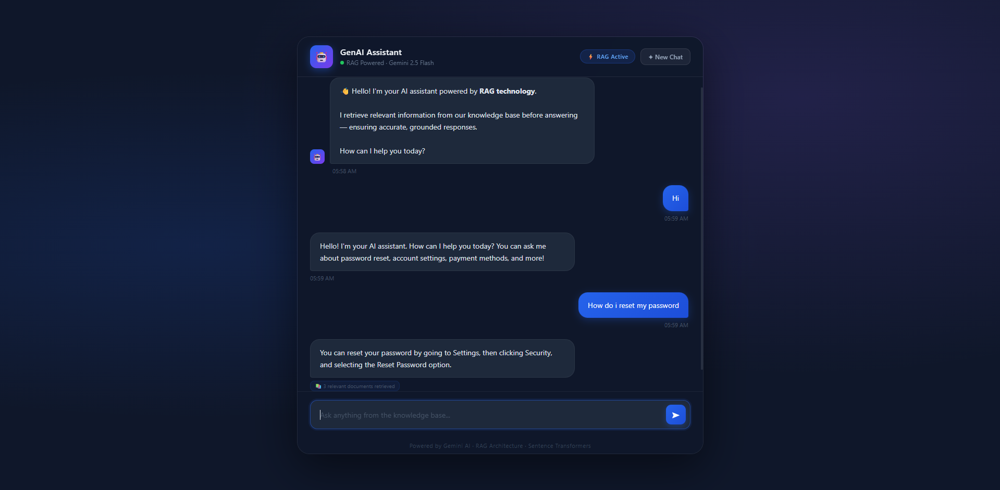

# GenAI Assistant with RAG

A production-style AI Chat Assistant built with Retrieval-Augmented Generation (RAG) technology.

## Live Demo
🚀  [Live Application](https://genai-rag-assistant-9a6q.onrender.com)

## Screenshots


---

## Architecture Overview

```
User Question
      ↓
Generate Query Embedding (Gemini Embedding API)
      ↓
Cosine Similarity Search
      ↓
Retrieve Top-3 Relevant Chunks
      ↓
Apply Similarity Threshold (0.3)
      ↓
Build Prompt (Context + History + Question)
      ↓
Gemini 2.5 Flash LLM
      ↓
Grounded Response to User
```
---

## Tech Stack

| Component | Technology |
|---|---|
| Backend | Python + Flask |
| LLM | Google Gemini 2.5 Flash |
| Embeddings | Sentence Transformers (all-MiniLM-L6-v2) |
| Similarity Search | Cosine Similarity (Scikit-learn) |
| Vector Storage | In-Memory |
| Frontend | HTML5 + CSS3 + JavaScript |

---

## RAG Workflow Explanation

### 1. Indexing Phase (On Startup)
- Load documents from `docs.json`
- Generate embeddings for each document using Sentence Transformers
- Store embeddings in memory with metadata

### 2. Query Phase (On Each Request)
- Convert user question to embedding vector
- Calculate cosine similarity with all stored embeddings
- Retrieve Top-3 most similar chunks
- Apply similarity threshold (0.3) — return fallback if below threshold
- Build prompt with context + history + question
- Send to Gemini API and return grounded response

---

## Embedding Strategy

**Model:** `all-MiniLM-L6-v2` from Sentence Transformers

**Why this model:**
- Free — no API key required
- Runs locally — no internet needed for embeddings
- Fast and lightweight — 90MB model
- Strong performance for semantic similarity tasks

**Process:**
```python
embedding = model.encode(text).tolist()
# Converts text meaning into 384-dimensional vector
```

---

## Similarity Search Logic

**Method:** Cosine Similarity

**Why Cosine Similarity:**
- Measures angle between vectors — not distance
- Works regardless of text length
- Captures semantic meaning — not just keywords
- Score range: 0 (not similar) to 1 (identical)

**Implementation:**
```python
score = cosine_similarity([query_vector], [doc_vector])[0][0]
```

**Threshold:** 0.3
- Score above 0.3 → Return answer from context
- Score below 0.3 → Return fallback response

---

## Prompt Design

You are a helpful customer support assistant.
RULES:

Answer ONLY from provided context
Use conversation history for follow-up questions
Return fallback if answer not in context

Context: {retrieved_documents}
History: {last_3_exchanges}
Question: {user_question}
Answer:

**Why this design:**
- Grounds responses in retrieved documents
- Prevents hallucination
- Enables follow-up question handling
- Low temperature (0.2) for consistent answers

---

## Project Structure

```
trueailab_assignment/
│
├── backend/
│   ├── main.py          # Flask API + session management
│   ├── embeddings.py    # Gemini Embedding API integration
│   ├── retrieval.py     # Cosine similarity search
│   ├── llm.py           # Gemini 2.5 Flash LLM integration
│   └── docs.json        # Knowledge base documents
│
├── frontend/
│   ├── index.html       # Chat UI
│   ├── style.css        # Professional dark theme styling
│   └── script.js        # Frontend interaction logic
│
├── screenshots/
│   └── chat.png         # Application screenshot
│
├── .env                 # API keys (not uploaded)
├── .env.example         # Environment variables template
├── .gitignore           # Git ignore rules
├── Procfile             # Render.com process configuration
├── render.yaml          # Render.com deployment configuration
├── requirements.txt     # Python dependencies
└── README.md            # Project documentation
```

---

## API Endpoints

### POST /api/chat
```json
Request:
{
  "sessionId": "abc123",
  "message": "How do I reset my password?"
}

Response:
{
  "reply": "You can reset your password from Settings > Security.",
  "tokensUsed": 45,
  "retrievedChunks": 3
}
```

### GET /health
```json
{
  "status": "healthy"
}
```

---

## Setup Instructions

### 1. Clone Repository
```bash
git clone https://github.com/yourusername/genai-rag-assistant.git
cd genai-rag-assistant
```

### 2. Install Dependencies
```bash
pip install -r requirements.txt
```

### 3. Setup Environment
```bash
cp .env.example .env
# Add your Gemini API key to .env file
```

### 4. Run Application
```bash
cd backend
py main.py
```

### 5. Open Browser